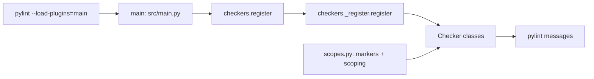

# Pylint Plugin

[](https://github.com/gajaguar/pylint-plugin/actions/workflows/ci.yml)
[](https://github.com/gajaguar/pylint-plugin/actions/workflows/python.yml)
[](https://docs.astral.sh/ruff/)
[](https://pylint.pycqa.org/)
[](http://mypy-lang.org/)
[](https://github.com/gajaguar/pylint-plugin)
[](https://docs.python.org/3.14/)
[](https://github.com/gajaguar/pylint-plugin)
[](LICENSE)

Opinionated pylint checkers that encode personal review preferences beyond
ruff, self-linting this repository.

## Table of Contents

- [About](#about)
- [Key features](#key-features)
- [Requirements](#requirements)
- [Usage](#usage)
- [Getting started](#getting-started)
- [Architecture](#architecture)
- [Built with](#built-with)
- [Configuration](#configuration)
  - [Rule reference](#rule-reference)
  - [Options](#options)
  - [Test scoping](#test-scoping)
  - [Make variables](#make-variables)
- [Contributing](#contributing)
- [Security](#security)
- [Open items](#open-items)
- [License](#license)

## About

Ruff with `lint.select = ["ALL"]` covers lint hygiene but leaves
review-time preferences unenforced: no docstrings on functions, mandatory
AAA section markers inside tests, `Final` annotations on module-level
constants, and similar project-specific rules. Restating these in code
review is repetitive and lossy.

This plugin encodes those preferences as 14 pylint checkers and runs them
against its own source tree. `make pylint` self-lints the repository with
the same rules, so a regression in the codebase fails the same gate that
defines the rule.

## Key features

- **14 enforced checkers**: docstrings, AAA test markers, blank-line
  discipline, imports, naming, `Final` annotations, `frozenset`
  constants, and `contextlib.suppress`.
- **Test-scoped rules**: the `app-test-*` checkers activate only on files
  under `tests/`, files matching `test_*.py` or `*_test.py`, or any parent
  named `test` or `tests`. Production code paths stay unaffected.
- **Configurable section markers**: tune the AAA markers via pylint
  option or environment variable without editing the plugin source.
- **Zero runtime dependencies**: the wheel ships with
  `dependencies = []`; only `pylint` is required to consume it.
- **Self-linting**: the plugin runs against itself in CI and in
  pre-commit; a rule violation fails the same gate that defines it.

## Requirements

Python 3.14 or higher — the package declares `requires-python = ">=3.14"`.
Install [uv](https://docs.astral.sh/uv/) for dependency management and
virtual environments. Install [pnpm](https://pnpm.io/) (or another Node
package manager) only if you plan to run the Markdown lint and spell
targets.

## Usage

Run pylint with the plugin against your source tree:

```bash
uv run pylint --load-plugins=main --disable=all --enable=app-no-docstrings,\
app-test-aaa-markers,app-test-no-blank-lines,app-test-no-extra-comments,\
app-test-partial-assertion,app-test-name-implementation-detail,\
app-unused-arg-use-del,app-module-const-naming,app-no-file-level-disable,\
app-no-inline-imports,app-no-relative-imports,app-use-contextlib-suppress,\
app-frozenset-constant,app-require-final src tests
```

The `main` argument is the module the wheel exposes at the package root
(see [Architecture](#architecture)). The `--disable=all` flag is
deliberate: pylint's built-in rules overlap with ruff (line length,
import placement), and `missing-module-docstring` conflicts with
`app-no-docstrings`. The `--enable=...` list selects only the plugin's
own rules.

For the local development loop in this repository:

```bash
make check   # read-only gate: lint, format, mypy, pyright, md-lint, spell, pylint
make fix     # apply safe auto-fixes
make test    # run the test suite
make help    # list every target
```

Scope a target to specific files:

```bash
make lint FILES="src/checkers/scopes.py"
make pylint FILES="src"
```

Override the AAA section markers without editing config:

```bash
TEST_SECTION_MARKERS="Given When Then" make pylint
```

## Getting started

### Use in another project

Add the plugin as a dev dependency:

```toml
[dependency-groups]
dev = ["pylint-plugin @ git+https://github.com/gajaguar/pylint-plugin"]
```

Then sync and run pylint with the plugin loaded (see [Usage](#usage) for
the full `--enable=...` command).

```bash
uv sync
```

### Develop this repository

Clone the repository and install everything (toolchain, Python deps,
Node toolchain, git hook):

```bash
git clone https://github.com/gajaguar/pylint-plugin.git
cd pylint-plugin
make install
```

## Architecture



The wheel ships a flat layout: `[tool.hatch.build.targets.wheel]` sets
`sources = ["src"]`, so `src/main.py` and `src/checkers/` are exposed as
top-level modules on the installed package. That is why
`--load-plugins=main` resolves: the plugin entry point is the `main.py`
file at the package root, not a nested `pylint_plugin` subpackage.

`src/main.py` re-exports `register` from `checkers`, and `register` in
`checkers/_register.py` instantiates and registers each checker with the
pylint linter. `scopes.py` provides the shared section-marker option and
test-scoping helpers that the `app-test-*` checkers consume.

## Built with

- [uv](https://docs.astral.sh/uv/) — dependency management and venv
- [hatchling](https://hatch.pypa.io/) — build backend
- [pylint](https://pylint.pycqa.org/) /
  [astroid](https://github.com/PyCQA/astroid) — checker host runtime
- [ruff](https://docs.astral.sh/ruff/) — lint and format
  (`lint.select = ["ALL"]`)
- [mypy](https://mypy-lang.org/) +
  [pyright](https://microsoft.github.io/pyright/) — strict static type
  checking
- [pytest](https://docs.pytest.org/) — test runner
- [markdownlint-cli2](https://github.com/DavidAnson/markdownlint-cli2)
  and [cspell](https://cspell.org/) via pnpm (dev-only) — Markdown lint
  and spell
- [pre-commit](https://pre-commit.com/) — git hook runner

## Configuration

### Rule reference

`app-smoke` registers with pylint but carries no messages; it exists to
verify the registration wiring. The remaining 14 rules each carry a
message code and report violations.

| Rule (`name`)                         | Code  | Enforces                                                        |
| ------------------------------------- | ----- | --------------------------------------------------------------- |
| `app-no-docstrings`                   | W9001 | No docstrings on functions, methods, or classes (use comments)  |
| `app-test-aaa-markers`                | W9002 | `test_*` bodies contain `# Arrange`, `# Act`, `# Assert`        |
| `app-test-no-blank-lines`             | W9003 | No blank lines inside test method bodies                        |
| `app-unused-arg-use-del`              | W9004 | Use `del arg` at body top, not a `_`-prefixed arg               |
| `app-module-const-naming`             | C9005 | Module-level names are `SCREAMING_SNAKE_CASE`                   |
| `app-no-file-level-disable`           | W9006 | No standalone `# pylint: disable=`; use inline / `disable-next` |
| `app-no-inline-imports`               | W9008 | Imports at module top, not inside functions                     |
| `app-no-relative-imports`             | W9009 | Absolute imports only                                           |
| `app-use-contextlib-suppress`         | W9012 | `contextlib.suppress(...)` over `try/except/pass`               |
| `app-frozenset-constant`              | W9013 | Module-level set constants use `frozenset(...)`                 |
| `app-require-final`                   | C9014 | Module-level constants carry a `Final` annotation               |
| `app-test-no-extra-comments`          | W9015 | Test bodies carry only the configured section markers           |
| `app-test-partial-assertion`          | W9016 | Field assertions without a whole-object assertion (advisory)    |
| `app-test-name-implementation-detail` | W9017 | Test names naming mocks, patches, internals (advisory)          |

`app-test-partial-assertion` and `app-test-name-implementation-detail`
use heuristics with a measurable false-positive rate; treat their output
as advisory, not a hard gate.

### Options

| Option                   | Type    | Default              | Description                                                                               |
| ------------------------ | ------- | -------------------- | ----------------------------------------------------------------------------------------- |
| `--test-section-markers` | csv     | `Arrange,Act,Assert` | Section names a test body must carry, in order, without their leading `#` comment marker. |
| `TEST_SECTION_MARKERS`   | env var | (unset)              | Space-separated section names. Overrides `--test-section-markers` when set.               |

Resolution order: `TEST_SECTION_MARKERS` (env) →
`--test-section-markers` (linter config) → the default tuple. Set the
env var to experiment with markers without rewriting the linter config.

### Test scoping

The `app-test-*` rules activate only on files matching one of these:

- Stem starts with `test_` (e.g. `test_module.py`)
- Stem ends with `_test` (e.g. `module_test.py`)
- Any parent directory is named `test` or `tests`

Files outside those paths are skipped entirely. Function-scoping applies
on top: a `test_*` function inside a test file is checked; a `helper`
function in the same file is not.

### Make variables

| Variable | Behavior         | Examples                                                                            |
| -------- | ---------------- | ----------------------------------------------------------------------------------- |
| `FILES`  | Scope by path    | `FILES="src/checkers/scopes.py"` or `FILES="src/checkers/*.py"`                     |
| `check*` | Read-only gate   | `make check`, `make lint`, `make pylint`, `make mypy`, `make md-lint`, `make spell` |
| `fix*`   | Mutates in place | `make fix`, `make lint-fix`, `make format`, `make md-fix`                           |

## Contributing

Contributions optimize this plugin. Fork the repository, create a
feature branch, commit your change, push, and open a Pull Request.

See [CONTRIBUTING.md](CONTRIBUTING.md) for the local setup, the
`check` vs `fix` convention, and the three-file procedure for adding a
new checker.

## Security

Report vulnerabilities privately by email to <dev@gajaguar.com>. Do not
open a public issue, pull request, or discussion.

See [SECURITY.md](SECURITY.md) for supported versions and the reporting
process.

## Open items

- Dynamic checker discovery to remove the three-file registration step.
- PyPI publication.
- `CHANGELOG.md`.

## License

Distributed under the MIT License. See [LICENSE](LICENSE) for the full
text.
